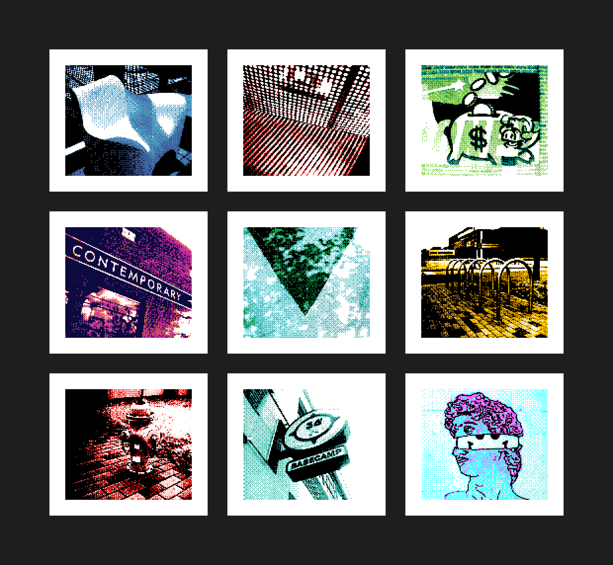

# Contact Sheet — a GB‑Printer Web plugin

Arranges a selection of images into a single **contact sheet** (a grid of numbered
thumbnails) and lets you download it as **PNG / JPG / WebP**.

Built for [gb-printer-web](https://github.com/HerrZatacke/gb-printer-web) using the
[plugin API](https://github.com/HerrZatacke/gb-printer-web-plugins).

---

## Installation

Install into the Plugin Settings tab of the gallery app using this URL https://cdn.jsdelivr.net/gh/cristofercruz/gb-gallery-plugin-contact-sheet@main/contact-sheet.js

---

## Configuration

All fields are optional. They appear as editable fields **both** on the plugin's
settings panel **and** in the export dialog (pre‑filled, see above), and edits made
in either place are saved. The **Default** column is the value used when a field is
left blank.

| Option        | Type   | Default     | Description |
|---------------|--------|-------------|-------------|
| `columns`     | number | `5`         | Thumbnails per row. |
| `scaleFactor` | number | `1`         | Per‑thumbnail render scale, **integer only** (`1` = native GB size, `2` = 2×, …). Higher = sharper and larger file. |
| `gutter`      | number | `0`         | Spacing *between* thumbnails. Output pixels, or source pixels if **Scale gap & margin** is on (see below). |
| `margin`      | number | `0`         | Outer margin around the whole sheet, independent of the gutter. Output pixels, or source pixels if **Scale gap & margin** is on. |
| `background`  | string | `#1e1e1e`   | Sheet background colour (`#rgb` or `#rrggbb`). Label colour auto‑switches for light vs dark. |
| `labels`      | string | `none`      | What to print under each image: `number`, `title`, `created`, `number+title`, or `none`. |
| `sortBy`      | string | `selection` | Cell order: `selection` (as picked), `title`, or `created`. |
| `headerText`  | string | *(empty)*   | Optional title drawn across the top of the sheet. |
| `fileType`    | string | `png`       | Output format: `png`, `jpg`, or `webp`. PNG stays crisp; JPG/WebP are smaller but add compression noise on the busy dither. |
| `frame`       | string | `default`   | Frame behavior, use global app default, keep, crop, make square |
| `scaleGapMargin` | string | `1`      | `1` (or blank) = treat `gutter`/`margin` as source pixels and scale them by `scaleFactor`; `0` = use them as output pixels. In the export dialog this appears as a **Yes/No** dropdown (stored as `1`/`0`). |

The downloaded file is named `contact-sheet-<timestamp>.<ext>`.